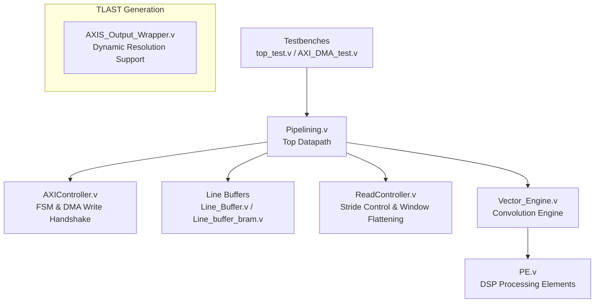
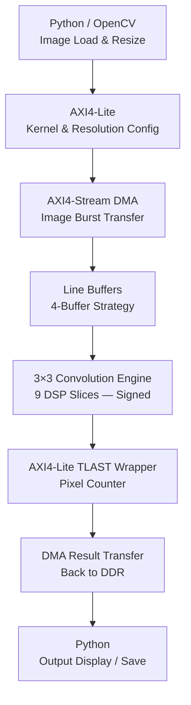
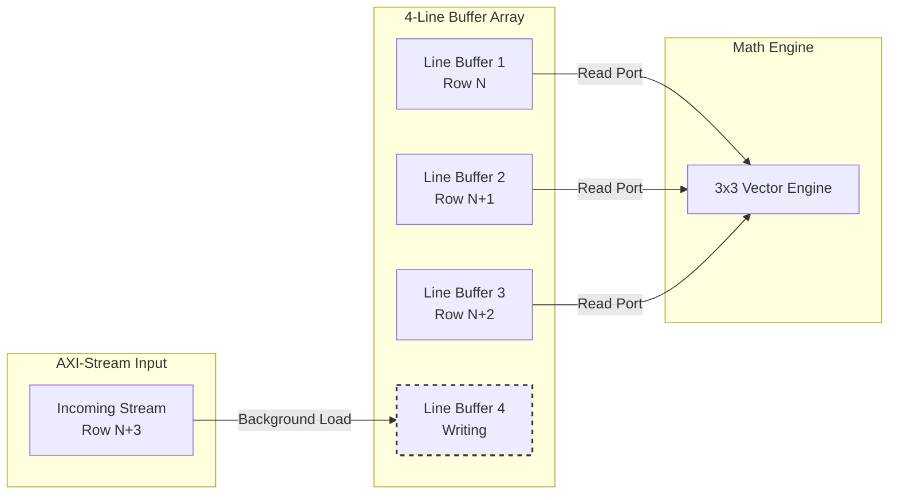
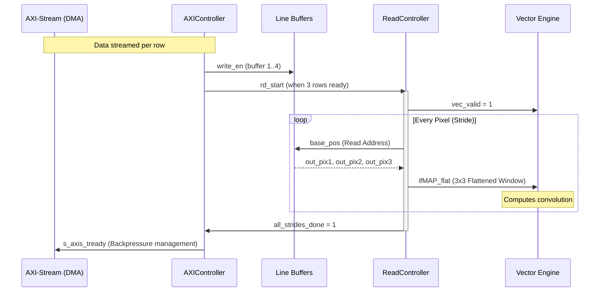
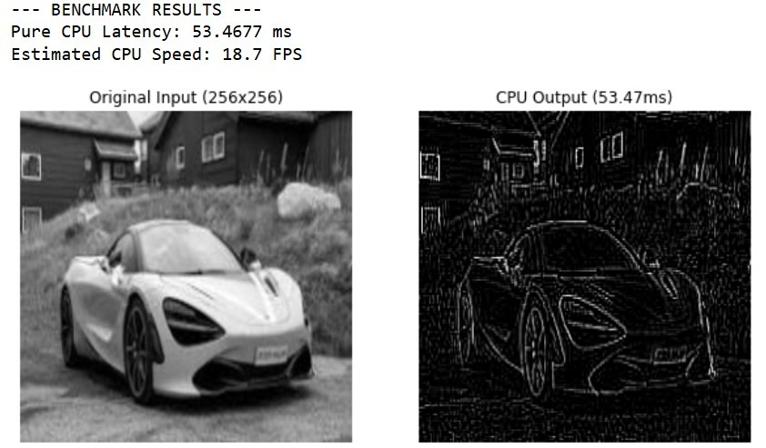
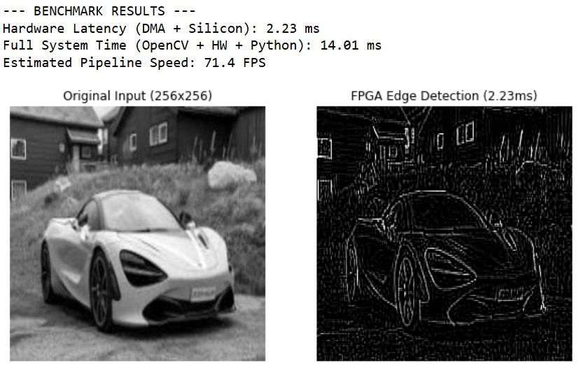
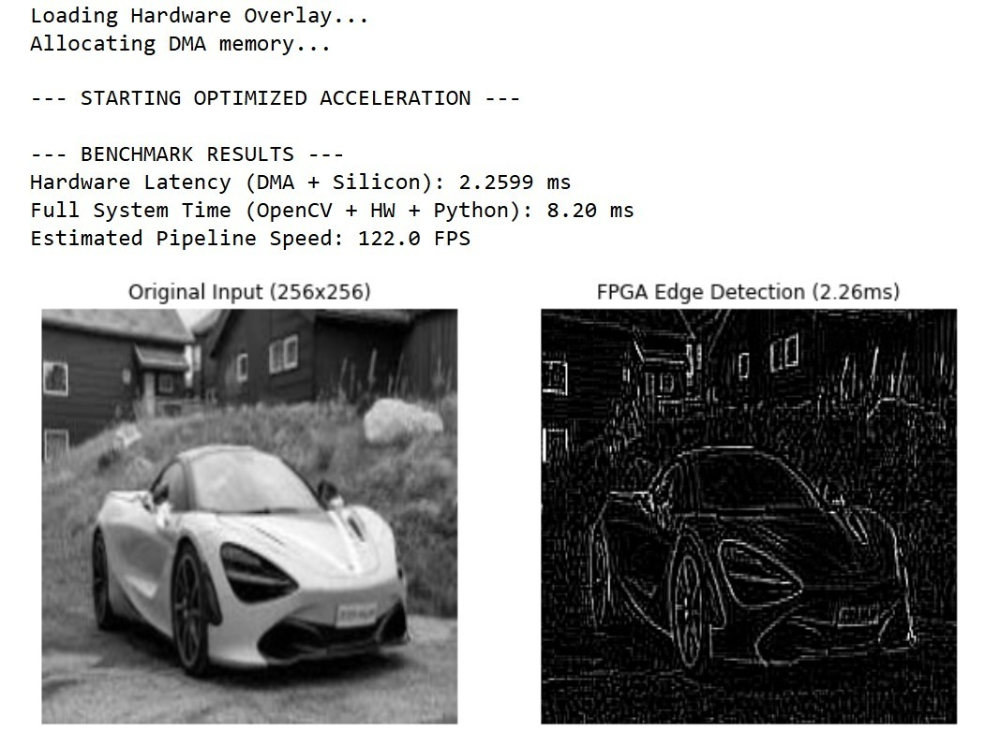
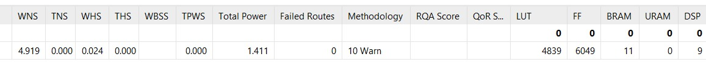

# CoreVision: Heterogeneous SoC Vision Accelerator

## Overview

CoreVision is a hardware-software co-design project that implements a custom **AXI-Stream 2D Convolution Engine** on the Xilinx Pynq Z2 System-on-Chip (SoC), targeting real-time edge AI and computer vision applications.

The accelerator leverages a highly pipelined Verilog datapath to execute 2D convolution operations in under 3 milliseconds, enabling feature extraction tasks such as edge detection and Gaussian blurring. By coupling physical DSP-slice acceleration with a Python/PYNQ software orchestration layer, the system demonstrates key heterogeneous compute concepts including DMA memory management, AXI streaming protocols, BRAM-based resource optimization, and software-level driver tuning for maximum throughput.

---

## Table of Contents
- [Key Features](#key-features)
- [Architecture](#architecture)
- [Data Flow](#data-flow)
- [Implementation Timeline](#implementation-timeline)
- [Challenges & Solutions](#challenges--solutions)
- [Results/Benchmarks](#resultsbenchmarks)
- [Resource Utilization](#resource-utilization)
- [Future Scope: CNN Restoration](#future-scope-cnn-restoration)
- [Setup & Usage](#setup--usage)

---

## Key Features

- **CPU-Bypassing DMA Pipeline:** Instead of forcing the ARM processor to transfer image pixels sequentially — a significant bottleneck — the system implements a Direct Memory Access (DMA) highway via AXI4-Stream. This allows the entire image to be streamed from DDR memory directly into the custom silicon in one continuous burst, completely freeing the CPU for other tasks during hardware execution.
- **True Reprogrammable SoC Design:** The system is not locked to a single operation. By exposing control registers through memory-mapped AXI4-Lite interfaces and a Python orchestration layer, the active convolution kernel (e.g., Blur, Laplacian, Sobel) and the target image resolution can both be swapped dynamically at runtime — without re-synthesizing or re-flashing the bitstream.
- **Push-Button Pipelined Execution:** The hardware datapath functions as a continuous, high-speed assembly line. Once the software writes the configuration registers, a single "master start" command in Python triggers autonomous hardware execution.
- **Native Signed Arithmetic:** The hardware datapath implements full signed convolution natively in silicon, enabling direct application of edge-detection kernels without any software decomposition or multi-pass workarounds.
- **Zero-Overhead DMA Memory Management:** DMA-contiguous buffers are allocated once at startup in global scope. The hot path utilizes `np.copyto()` for zero-overhead buffer reuse, eliminating repeated OS-level memory requests and removing up to 25ms of Linux kernel overhead per call, delivering bare-metal throughput from Python.

---

## Architecture

The system partitions its workload across two compute domains:

**1. The Software Orchestrator (ARM Cortex-A9 / Python)**
Responsible for image acquisition and preprocessing via OpenCV, kernel definition, AXI-Lite register configuration, global DMA transaction management, and interrupt handling.

**2. The Hardware Accelerator (Programmable Logic / Verilog)**
Responsible for all pixel-level computation. It comprises AXI controllers, line buffers, processing elements (DSP slices), and flow-control logic.

### Hardware Module Hierarchy
The custom Verilog design is structured hierarchically. The testbench drives the `Pipelining.v` datapath, which instantiates the individual control and math modules.

---

## Data Flow

### High-Level System Data Flow
The overarching data flow traces a path from Python space through the hardware and back, utilizing both memory-mapped (AXI4-Lite) and streaming (AXI4-Stream) interfaces.

### The 4-Buffer "Zero Downtime" Strategy
Applying a 3×3 convolution kernel requires simultaneous access to three consecutive image rows. To eliminate stalling when loading a new row, the design uses **four line buffers**. While the Vector Engine actively consumes data from three buffers, the fourth buffer silently pre-fetches the next image row via AXI-Stream. This double-buffering strategy completely hides load latency.

### Smart Traffic Control Handshake
The `ReadController.v` Acts as a flow-control arbiter. It initiates reads when `rd_start` is triggered by the AXI controller, feeds flattened 3x3 pixel windows (`ifMAP_flat`) to the Vector Engine, and signals when a full stride (row) is completed to manage AXI backpressure.

---

## Implementation Timeline

### V1.x — Hardware-Software Co-Design (Two-Pass Compensation)
*Initial version featured an optimized but strictly unsigned hardware datapath.*

| Version | Key Change | File Focus |
|---------|-----------|------|
| **V1.0** — Deadlock Fix | Resolved AXI-Stream DMA deadlocks by exposing `TOTAL_PIXELS` via dynamic AXI-Lite registers, bypassing static Vivado GUI parameters. | `AXIS_Output_Wrapper.v` |
| **V1.1** — Software Compensation | Implemented Python-level Kernel Decomposition. Signed edge-detection matrices are split into positive sub-arrays; the hardware runs twice and results are combined in software. | `Two_Pass_Edge_Detection.py` |

### V2.x — Full Native Signed Hardware + Resource Optimization
*Silicon upgraded to handle signed arithmetic directly; resource footprint dramatically reduced.*

| Version | Key Change |
|---------|-----------|
| **V2.0** — Native Signed Arithmetic | Rewrote the convolution datapath to support signed multiplication and accumulation natively. Signed edge-detection kernels now run in a single hardware pass. |
| **V2.1** — BRAM Line Buffers | Migrated line buffers from distributed LUT-RAM to Block RAM primitives. |
| **V2.2** — Pre-Allocated DMA Buffers | Moved `allocate()` calls for DMA-contiguous memory out of the convolution function and into global scope for zero-overhead buffer reuse via `np.copyto()`. |

---

## Challenges & Solutions

| Challenge | Solution |
|-----------|---------|
| **AXI-Stream DMA Deadlocks** | Exposed the `TOTAL_PIXELS` parameter as a runtime-writable AXI-Lite register rather than a static synthesis parameter, allowing the DMA to correctly identify frame boundaries. |
| **Vivado Dead Code Elimination** | Widened FSM state pointers from 5-bit to 8-bit, providing enough address space to prevent the synthesizer from pruning logic paths as unreachable. |
| **Unsigned Silicon with Signed Kernels** | Implemented mathematical kernel decomposition in Python to split signed matrices into positive sub-kernels, running two hardware passes and recombining in software (V1.x). Replaced entirely with native signed arithmetic in V2.0. |
| **DSP Pipeline Starvation** | Adopted a 4-buffer line buffer strategy, hiding row-load latency behind active computation to keep the DSP pipeline continuously fed. |
| **High LUT Utilization** | Replaced distributed LUT-based line buffers with dedicated BRAM primitives, slashing LUT usage significantly. |
| **OS Overhead in DMA Transfers** | Moved DMA buffer allocation to global scope so Linux memory management is invoked exactly once at startup. The hot path now uses `np.copyto()`. |

---

## Results/Benchmarks

Three configurations were benchmarked against a 256×256 grayscale image (using a Laplacian Edge Detection kernel) to quantify the impact of each optimization stage.

| Configuration | HW Latency | Full System Time | FPS |
|---------------|-----------|-----------------|-----|
| **CPU Baseline** (NumPy convolution) | — | 53.47 ms | 18.7 |
| **FPGA — No BRAM** | 2.23 ms | 14.01 ms | 71.4 |
| **FPGA — BRAM + Pre-alloc DMA** | 2.26 ms | 8.20 ms | **122.0** |

### 1. CPU Baseline
**18.7 FPS (53.47ms full system time)**
*This is the pure software convolution baseline executed on the ARM Cortex-A9 processor. The sequential nature of the CPU makes pixel-by-pixel operations a major bottleneck.*

 

### 2. FPGA Unsigned / Signed (No BRAM)
**71.4 FPS (2.23ms HW latency, 14.01ms full system time)**
*Moving the math to the FPGA immediately dropped the computation time to a near-optimal ~2.23ms. However, overall FPS was held back by software driver overhead, specifically Linux re-allocating physical memory blocks on every single function call.*

 

### 3. FPGA Signed + BRAM + Pre-Allocated DMA
**122.0 FPS (2.26ms HW latency, 8.20ms full system time)**
*The hardware compute time (2.26ms) remained identical, proving the silicon was already optimal. The massive jump from 71.4 to 122 FPS is entirely due to the software optimization: pre-allocating the DMA buffers globally and reusing them with `np.copyto()`, stripping away ~5.8ms of OS overhead per frame.*

---

## Resource Utilization

Migrating the line buffers from distributed LUT-RAM to Block RAM (BRAM) primitives (`Line_buffer_bram.v`) had no impact on throughput or timing, but dramatically reduced the logic footprint of the accelerator.

| Version | LUTs | Flip-Flops | BRAM | DSP Slices |
|---------|------|------------|------|------------|
| V1.x / V2.0 (LUT-RAM) | 12,360 | — | 5 | 9 |
| V2.1+ (BRAM) | **4,839** | — | 11 | 9 |

### Before Optimization (LUT-RAM)
*High LUT usage (12,360) left very little logic headroom on the Pynq Z2 for deeper pipelines or additional neural network layers.*

 

### After Optimization (BRAM)
*LUT count dropped by **61%** (down to 4,839) at the cost of only 6 additional BRAM units, freeing over 7,500 LUTs for future scalability.*

---

## Future Scope: CNN Restoration

The immediate next step is evolving this architecture from a single-filter feature extractor into a full **End-to-End Edge AI Inference System**.

- **CNN Super-Resolution / Restoration:** Deploy a multi-layer Convolutional Neural Network directly on the FPGA to restore degraded or noisy images at the edge, eliminating the need for cloud offload.
- **Systolic Array Upgrade:** Replace the current 9-DSP sliding window with a Systolic Array architecture to scale MAC (Multiply-Accumulate) throughput across deeper network layers.
- **AXI4 Full Burst Transfers:** Optimize memory bandwidth via full AXI4 burst mode to sustain throughput for deeper CNN pipelines without memory starvation.

---

## Setup & Usage

1. Flash `design_1.bit` and `design_1.hwh` to the Zynq board via the PYNQ web interface.
2. Open the provided Jupyter Notebook (`SOC_test_256x256.py` or similar) on the board.
3. Define a 3×3 convolution kernel via the memory-mapped registers (e.g., Gaussian Blur, Laplacian Edge Detection, Sobel).
4. Load a grayscale image and stream it through the AXI DMA using the Python orchestration layer.
