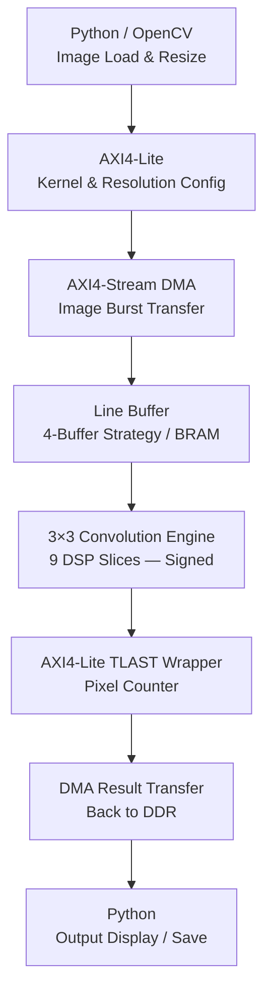

# CoreVision: Heterogeneous SoC Vision Accelerator

## Overview

CoreVision is a hardware-software co-design project that implements a custom **AXI-Stream 2D Convolution Engine** on the Xilinx Pynq Z2 System-on-Chip (SoC), targeting real-time edge AI and computer vision applications.

The accelerator leverages a highly pipelined Verilog datapath to execute 2D convolution operations in under 3 milliseconds, enabling feature extraction tasks such as edge detection and Gaussian blurring. By coupling physical DSP-slice acceleration with a Python/PYNQ software orchestration layer, the system demonstrates key heterogeneous compute concepts including DMA memory management, AXI streaming protocols, BRAM-based resource optimization, and software-level driver tuning for maximum throughput.

---

## Table of Contents
1. [Key Features](#key-features)
2. [Tech Stack & Materials](#tech-stack--materials)
3. [System Architecture](#system-architecture)
4. [Implementation Phases](#implementation-phases)
5. [Challenges & Solutions](#challenges--solutions)
6. [Usage & Benchmarks](#usage--benchmarks)
7. [Future Scope: CNN Restoration](#future-scope-cnn-image-restoration)
8. [Gallery](#gallery)

---

## Key Features

- **CPU-Bypassing DMA Pipeline:** Instead of forcing the ARM processor to transfer image pixels sequentially — a significant bottleneck — the system implements a Direct Memory Access (DMA) highway via AXI4-Stream. This allows the entire image to be streamed from DDR memory directly into the custom silicon in one continuous burst, completely freeing the CPU for other tasks during hardware execution.

- **True Reprogrammable SoC Design:** The system is not locked to a single operation. By exposing control registers through memory-mapped AXI4-Lite interfaces and a Python orchestration layer, the active convolution kernel (e.g., Blur, Laplacian, Sobel) and the target image resolution can both be swapped dynamically at runtime — without re-synthesizing or re-flashing the bitstream.

- **Push-Button Pipelined Execution:** The hardware datapath functions as a continuous, high-speed assembly line. Once the software writes the configuration registers, a single "master start" command in Python triggers autonomous hardware execution. From that point forward, the accelerator processes a new pixel on every rising clock edge without any further CPU involvement.

- **Native Signed Arithmetic:** The final hardware datapath implements full signed convolution natively in silicon, enabling direct application of edge-detection kernels (Laplacian, Sobel) without any software decomposition or multi-pass workarounds.

- **BRAM-Based Line Buffer Optimization:** Line buffers were migrated from distributed LUT-RAM to dedicated Block RAM (BRAM) primitives. This reduced LUT utilization from 12,360 to 4,839 while consuming only 5 BRAM units — freeing over 7,500 LUTs for future logic without any impact on throughput or timing.

- **Zero-Overhead DMA Memory Management:** DMA-contiguous buffers are allocated once at startup in global scope rather than inside the convolution function. This eliminates repeated OS-level memory requests from the hot path, removing up to 25ms of Linux kernel overhead per call and delivering true bare-metal throughput from Python.

---

## Tech Stack & Materials

### Hardware
| Component | Details |
|-----------|---------|
| **Target Board** | Xilinx Pynq Z2 |
| **Processing System (PS)** | ARM Cortex-A9 — runs Python orchestration layer |
| **Programmable Logic (PL)** | Custom Verilog datapath — 9 DSP slices, 4,839 LUTs, 5 BRAMs |
| **High-Throughput Bus** | AXI4-Stream — DMA image transfers |
| **Control Bus** | AXI4-Lite — memory-mapped configuration registers |

### Software & Tools
| Category | Tools |
|----------|-------|
| **RTL Design** | Xilinx Vivado (Verilog + Block Design) |
| **Software Stack** | PYNQ Framework (Jupyter Notebooks) |
| **Libraries** | Python, NumPy, OpenCV, Matplotlib |

---

## System Architecture

The system partitions its workload across two compute domains:

**1. The Software Orchestrator (ARM Cortex-A9 / Python)**
Responsible for image acquisition and preprocessing via OpenCV, kernel definition, AXI-Lite register configuration, DMA transaction management, and interrupt handling.

**2. The Hardware Accelerator (Programmable Logic / Verilog)**
Responsible for all pixel-level computation. The key hardware subsystems are described below.

### Data Flow

---

### The 4-Buffer "Zero Downtime" Line Buffer Strategy
Applying a 3×3 convolution kernel requires simultaneous access to three consecutive image rows. A naive three-buffer design would force the math engine to stall every time a new row is loaded. To eliminate this bottleneck, the design uses **four line buffers**. While the Vector Engine actively consumes data from three buffers, the fourth buffer silently pre-fetches the next image row in the background. This double-buffering strategy completely hides load latency and guarantees the DSP pipeline is never starved for data.

### Smart Traffic Control — The Read Controller
A custom Read Controller FSM acts as a flow-control arbiter between the incoming AXI-Stream and the Vector Engine. It implements a bidirectional handshake: if memory cannot deliver data fast enough, the math engine is held in a safe paused state; if the math engine lags, the incoming stream is held via AXI backpressure. This continuous handshake ensures no pixels are dropped or corrupted, even under transient system load.

### Dynamic Image Resizing — The AXI4-Lite TLAST Wrapper
Standard hardware accelerators are typically hardcoded to a single fixed image resolution, requiring re-synthesis to change. The `AXIS_Output_Wrapper.v` module solves this by reading a `TOTAL_PIXELS` register written by Python over AXI4-Lite at runtime. The wrapper autonomously counts the pixel stream and asserts the AXI `TLAST` signal at the correct boundary, signaling end-of-frame to the DMA. This allows the same bitstream to process a 256×256 image one run and a 1080p frame the next, with no hardware changes.

### Software Compensation for Hardware Limits (V1.x)
The initial hardware datapath was strictly unsigned, which prevented direct application of signed convolution kernels (required for edge detection). Rather than discarding the working silicon, a **Kernel Decomposition** technique was implemented in Python: any signed kernel is mathematically split into two strictly positive sub-kernels. The hardware runs twice — once per sub-kernel — and the results are subtracted in software to reconstruct the correct signed output. This workaround delivered full edge detection capability without modifying the RTL. Native signed arithmetic was subsequently implemented in V2.0.

---

## Implementation Phases

### V1.x — Hardware-Software Co-Design (Two-Pass Compensation)
*Initial version featured an optimized but strictly unsigned hardware datapath.*

| Version | Key Change | File Focus |
|---------|-----------|------|
| **V1.0** — Deadlock Fix | Resolved AXI-Stream DMA deadlocks by exposing `TOTAL_PIXELS` via dynamic AXI-Lite registers, bypassing static Vivado GUI parameters. | `AXIS_Output_Wrapper.v` |
| **V1.1** — Software Compensation | Implemented Python-level Kernel Decomposition. Signed edge-detection matrices are split into positive sub-arrays; the hardware runs twice and results are combined in software. | `Two_Pass_Edge_Detection.py` |

### V2.x — Full Native Signed Hardware + Resource Optimization
*Silicon upgraded to handle signed arithmetic directly; resource footprint dramatically reduced.*

| Version | Key Change |
|---------|-----------|
| **V2.0** — Native Signed Arithmetic | Rewrote the convolution datapath to support signed multiplication and accumulation natively, eliminating the two-pass software workaround entirely. Signed edge-detection kernels now run in a single hardware pass. |
| **V2.1** — BRAM Line Buffers | Migrated line buffers from distributed LUT-RAM to Block RAM primitives. LUT count dropped from 12,360 to 4,839 while adding only 5 BRAM units. Throughput and timing were unaffected. See `Line_Buffer_Bram.v`. |
| **V2.2** — Pre-Allocated DMA Buffers | Moved `allocate()` calls for DMA-contiguous memory out of the convolution function and into global scope. Buffers are claimed once at startup; subsequent calls use `np.copyto()` to overwrite in place. This eliminated repeated Linux memory-manager overhead from the critical path, cutting full system time from ~14ms to ~8.2ms. |

---

## Challenges & Solutions

| Challenge | Solution |
|-----------|---------|
| **AXI-Stream DMA Deadlocks** | Exposed the `TOTAL_PIXELS` parameter as a runtime-writable AXI-Lite register rather than a static synthesis parameter, allowing the DMA to correctly identify frame boundaries. |
| **Vivado Dead Code Elimination** | Widened FSM state pointers from 5-bit to 8-bit, providing enough address space to prevent the synthesizer from pruning logic paths as unreachable. |
| **Unsigned Silicon with Signed Kernels** | Implemented mathematical kernel decomposition in Python to split signed matrices into positive sub-kernels, running two hardware passes and recombining in software (V1.x). Replaced entirely with native signed arithmetic in V2.0. |
| **DSP Pipeline Starvation** | Adopted a 4-buffer line buffer strategy, hiding row-load latency behind active computation to keep the DSP pipeline continuously fed. |
| **Fixed-Resolution Hardware** | Designed the AXI4-Lite TLAST Wrapper to read a software-defined pixel count at runtime, making the accelerator resolution-agnostic without re-synthesis. |
| **High LUT Utilization** | Replaced distributed LUT-based line buffers with dedicated BRAM primitives, reducing LUT count from 12,360 to 4,839 at the cost of only 5 BRAM blocks. |
| **OS Overhead in DMA Transfers** | Moved DMA buffer allocation to global scope so Linux memory management is invoked exactly once at startup. The hot path now uses `np.copyto()` for zero-overhead buffer reuse, cutting full system latency from ~14ms to ~8.2ms. |

---

## Usage & Benchmarks

### Setup
1. Flash `design_1.bit` and `design_1.hwh` to the Zynq board via the PYNQ web interface.
2. Open the provided Jupyter Notebook on the board.
3. Define a 3×3 convolution kernel (e.g., Gaussian Blur, Laplacian Edge Detection, Sobel).
4. Load a grayscale image and stream it through the AXI DMA using the notebook cells.

### Performance Benchmark (256×256 Grayscale Image — Laplacian Edge Detection)

Three configurations were benchmarked against the same input image to quantify the impact of each optimization stage.

| Configuration | HW Latency | Full System Time | FPS |
|---------------|-----------|-----------------|-----|
| **CPU Baseline** (pure NumPy convolution) | — | 53.47 ms | 18.7 |
| **FPGA — Unsigned / Signed, no BRAM** | 2.23 ms | 14.01 ms | 71.4 |
| **FPGA — Signed + BRAM + Pre-alloc DMA** | 2.26 ms | 8.20 ms | **122.0** |

**Key takeaways:**
- The FPGA hardware kernel itself runs in ~2.26ms across all FPGA configurations — the silicon compute time is already optimal.
- The jump from 71.4 to 122.0 FPS is entirely a **software driver improvement**: eliminating repeated OS memory allocation from the convolution call removed ~5.8ms of Linux kernel overhead per frame.
- BRAM migration had no effect on latency but reduced LUT utilization by **61%** (12,360 → 4,839 LUTs), freeing headroom for deeper future pipelines.

### Resource Utilization

| Version | LUTs | Flip-Flops | BRAM | DSP Slices |
|---------|------|------------|------|------------|
| V1.x / V2.0 (LUT-RAM) | 12,360 | — | 5 | 9 |
| V2.1+ (BRAM) | 4,839 | — | 11 | 9 |

---

## Future Scope: CNN Image Restoration

The immediate next step is evolving this architecture from a single-filter feature extractor into a full **End-to-End Edge AI Inference System**.

- **CNN Super-Resolution / Restoration:** Deploy a multi-layer Convolutional Neural Network directly on the FPGA to restore degraded or noisy images at the edge, eliminating the need for cloud offload.
- **Systolic Array Upgrade:** Replace the current 9-DSP sliding window with a Systolic Array architecture to scale MAC (Multiply-Accumulate) throughput across deeper network layers.
- **AXI4 Full Burst Transfers:** Optimize memory bandwidth via full AXI4 burst mode to sustain throughput for deeper CNN pipelines without memory starvation.

---

## Gallery

### Benchmark 1 — CPU Baseline
*Pure software convolution on the ARM Cortex-A9: 53.47ms, 18.7 FPS.*

### Benchmark 2 — FPGA Unsigned / Signed (No BRAM)
*Hardware accelerated, single-pass. HW latency 2.23ms, full system 14.01ms, 71.4 FPS.*

### Benchmark 3 — FPGA Signed + BRAM + Pre-Allocated DMA
*Best configuration. HW latency 2.26ms, full system 8.20ms, 122.0 FPS.*

## Resource Utilization Report
### Line Buffers implemented using LUT-RAM

### Line Buffers implemented using BRAM

